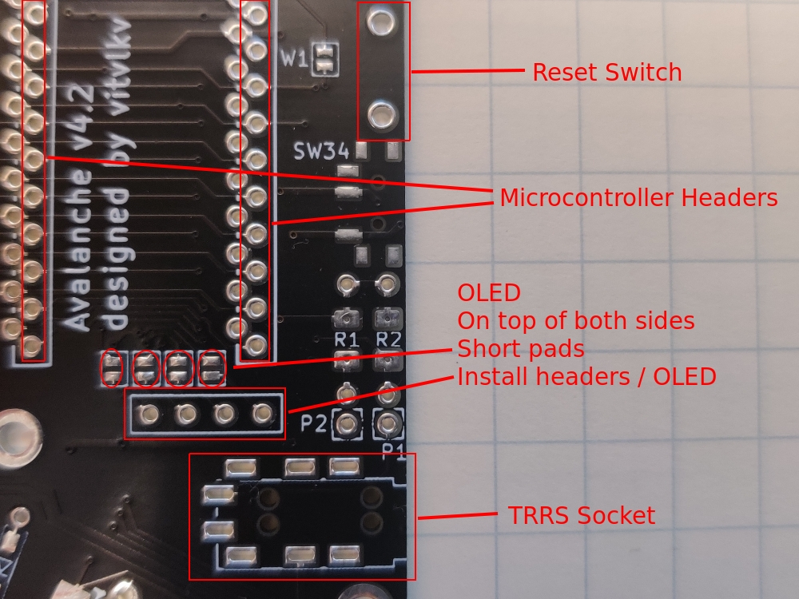
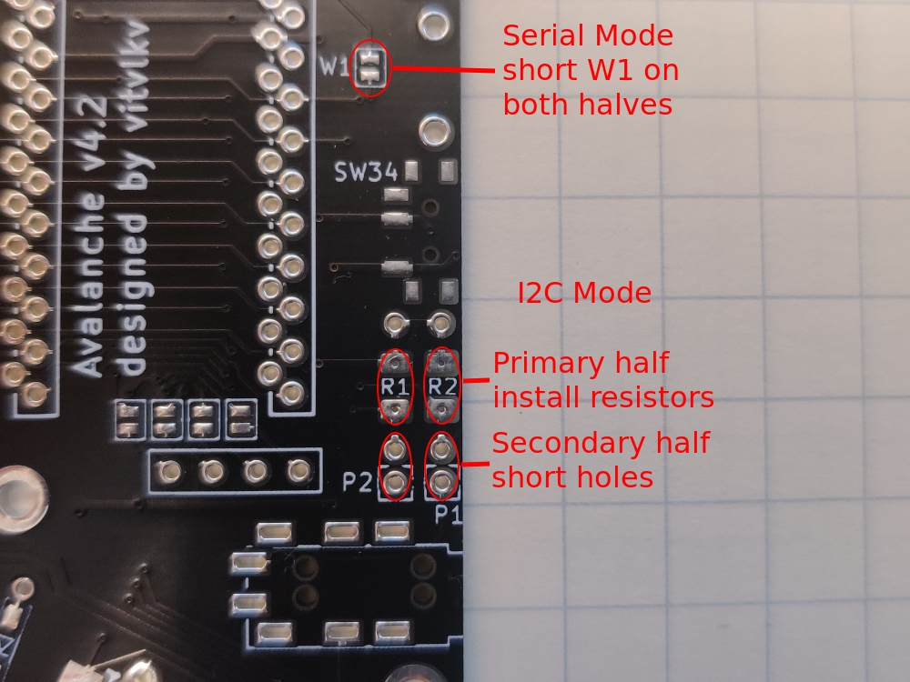

## The Avalanche keyboard build instuctions

### Diodes

Both SMD and through-hole types of diodes are supported. The stripe on the diode should match the silk screen so that the line on the diode is on the same side.

Through-hole diodes are nice when using Mill-Max sockets because the trimmed diode wires can be used as the ProMicro pins.

### Switch hotswap sockets

Install the hotswap sockets on the same side as the diodes.

I recommend the following way of soldering the hotswap sockets. Take the top plate, insert all switches into the top plate holes. Then place the top plate onto the PCB. Take switch sockets and place them to their dedicated places on the bottom side of the PCB. The switch sockets will be fixed with the switch pins stopping them from falling away or move anywhere around. Now solder the switch sockets to the PCB (with comfort).

### Component locations

### ProMicro sockets

Mill-Max headers must be used, standard header pins do not fit.

Install the ProMicro on the opposite side as the sockets and diodes. Install the ProMicro upside down for a cleaner look, the silk screen indicates where the headers should be seated. To install the ProMicro right side up, use the other header position.

Solder the sockets to the PCBs. Solder one pin, adjust by resoldering the one pin until socket is positioned at 90 degrees. Only after that solder other pins. Be careful when soldering the socket's pins to avoid bridging the unused pads. You should not short circuit unused pads with the pins.

For low profile Mill-Max type headers, you can now solder the ProMicro header pins. This is a good time to re-use the diode legs if through-hole diodes were used. Solid core 24 AWG wire also works very well. Put some painter's tape (or similar) between sockets and ProMicros before soldering the pins. Otherwise the pins could be soldered with the sockets.

### Reset switch and TRRS socket

Solder them on the same side as the ProMicro.

### OLED

Install headers below the ProMicro sockets and bridge the nearby pads on the same side as the OLED. If the ProMicro has already been installed you may need to remobe it in order to access the pads.

### Choose Serial or I2C
I2C provides less latency in communication between the halves of the keyboard. This latency difference begins to be noticible when typing above 100 words per minute.

* I2C: On the master board (left by default) solder 4.7k resistors R1, R2.
  On the secondary board (right by default) connect P1 to R1 and P2 to R2 (the closest holes to each).
  Modify your qmk firmware `config.h` with `#define USE_I2C` instead of `#define USE_SERIAL`.
  Use only TRRS cable to connect keyboard halves.

* Serial: On both halves you should short circuit the W1 jumper.
  Modify your qmk firmware `config.h` with `#define USE_SERIAL` instead of `#define USE_I2C`.
  Use TRS or TRRS cable to connect keyboard halves.

This doc of the [QMK site](https://beta.docs.qmk.fm/using-qmk/hardware-features/feature_split_keyboard) has
additional information.

### Break off the numbers row

* Break off the numbers row, if you do not need/like it.
* If you are using per-switch LEDs, then short circuit the J9, J10, J11 jumpers.

### Choose per-switch or backlight LEDs
It is not recommended to install both per-switch and backlight LEDs (for aestetical reasons).

* For backlight LEDs, just solder them

* For per-switch LEDs, you should short circuit the data-in of the first backlight LED with the data-in of the first per-key LED with some wire (or data-in to data-out pins on all backlight LEDs). Of course, it is supposed that you do not install the backlight LEDs at all.

### Rotary encoders
* IMPORTANT NOTE: Only 1 rotary encoder could be installed on each half.
* Solder all 7 pins of rotary encoders to the PCB this fixes the encoder the best.
* Do not install both kailh socket and rotary encoder into the same switch slot on the PCB. Install either one.
